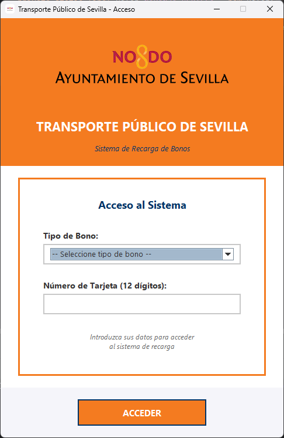
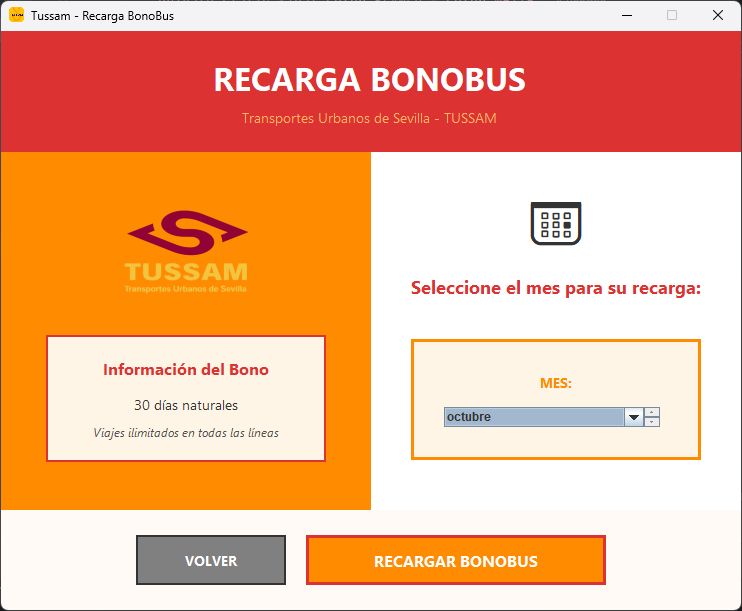
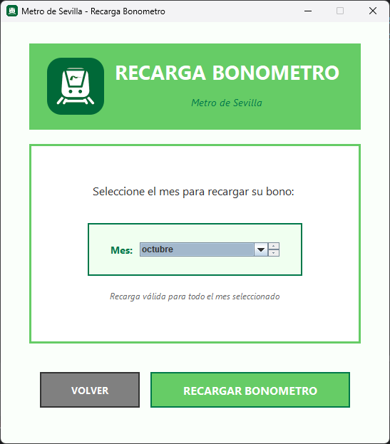

# 🚍🚇 Sistema de Recarga de Transporte Público de Sevilla

Aplicación de escritorio desarrollada en Java Swing para la gestión y recarga de abonos de transporte público en Sevilla (BonoBus y BonoMetro).

## 📋 Descripción del Proyecto

Este proyecto implementa un sistema completo de recarga de abonos de transporte público que permite a los usuarios:
- Seleccionar entre BonoBus (Tussam) y BonoMetro
- Validar el número de tarjeta (12 dígitos)
- Seleccionar el mes de recarga deseado
- Confirmar y procesar la recarga del abono

## 🎯 Características Principales

### Funcionalidades Implementadas

- **Sistema de Login**: Pantalla inicial con validación de tipo de bono y número de tarjeta
- **Interfaz BonoBus**: Diseño corporativo con colores naranja y rojo de Tussam
- **Interfaz BonoMetro**: Diseño con tonos verdes característicos del Metro de Sevilla
- **Selector de Mes**: Utiliza `JMonthChooser` de la librería JCalendar
- **Validaciones**: Control de campos obligatorios y formato de tarjeta
- **Confirmaciones**: Diálogos de confirmación para acciones críticas
- **Tooltips**: Información contextual en botones y campos
- **Iconos Personalizados**: Iconos diferentes para Bus y Tren
- **Efectos Hover**: Interactividad visual en botones
- **Confirmación de Cierre**: `WindowListener` para prevenir cierres accidentales

## 🛠️ Tecnologías Utilizadas

- **Java**: Lenguaje de programación principal
- **Java Swing**: Framework para la interfaz gráfica
- **JCalendar**: Librería externa para el componente `JMonthChooser`
- **AWT**: Para manejo de eventos y componentes adicionales

## 📁 Estructura del Proyecto

```
proyecto/
│
├── src/
│   ├── login.java                # Ventana principal de acceso
│   ├── BonoBus.java              # Interfaz de recarga BonoBus
│   └── BonoMetro.java            # Interfaz de recarga BonoMetro
│
└── resources/
    ├── sevilla_icon.png          # Icono de la ventana de login
    ├── bus_icon.png              # Icono de la ventana BonoBus
    ├── bus_image.png             # Imagen del autobús
    ├── metro_icon.png            # Icono de la ventana BonoMetro
    ├── title_image.png           # Imagen del tren
    └── ayuntamiento_sevilla.png  # Logo del ayuntamiento

```

## 🚀 Instalación y Ejecución

### Requisitos Previos

- Java Development Kit (JDK) 8 o superior
- IDE Java (IntelliJ IDEA, Eclipse, NetBeans, etc.) o Maven
- Maven (las dependencias se descargan automáticamente desde `pom.xml`)

### Pasos para Ejecutar

1. **Clonar o descargar el proyecto**
   ```bash
   git clone https://github.com/gabiisnchez/DI03_BonoTransporte
   cd DI03_BonoTransporte
   ```

2. **Descargar dependencias** (automático con Maven)
   ```bash
   mvn clean install
   ```
   
   > **📦 Nota:** La librería JCalendar 1.4 está configurada como dependencia en el archivo `pom.xml`, por lo que Maven la descargará automáticamente. No es necesario descargarla manualmente.

3. **Ejecutar la aplicación**
   
   **Desde el IDE:**
   - Abrir el proyecto en tu IDE favorito
   - Localizar la clase `login.java` en el paquete `src/`
   - **Hacer clic derecho sobre `login.java` → Run 'login.main()'**
   - O simplemente ejecutar el método `main()` de la clase `login`

   **Desde línea de comandos con Maven:**
   ```bash
   mvn exec:java -Dexec.mainClass="login"
   ```

> **⚠️ IMPORTANTE**: La clase `login.java` es el **punto de entrada** de la aplicación. Es la ventana principal que debe ejecutarse para iniciar el programa. Las clases `BonoBus.java` y `BonoMetro.java` son ventanas secundarias que se abren desde el login.

## 📖 Guía de Uso

### 1. Pantalla de Login

- Seleccionar el tipo de bono (BonoBus o BonoMetro)
- Introducir número de tarjeta (12 dígitos)
- Hacer clic en "ACCEDER"

### 2. Recarga de Abono

- Seleccionar el mes deseado del selector
- Revisar la información del bono
- Hacer clic en "RECARGAR BONOBUS" o "RECARGAR BONOMETRO"
- Confirmar la operación

### 3. Navegación

- Usar el botón "VOLVER" para regresar al login
- Cerrar la ventana requiere confirmación

## 🎨 Diseño y Paleta de Colores

### BonoBus (Tussam)
- **Naranja Principal**: `#FF8C00` (255, 140, 0)
- **Rojo Tussam**: `#DC3232` (220, 50, 50)
- **Naranja Claro**: `#FFB464` (255, 180, 100)
- **Fondo Crema**: `#FFF5E6` (255, 245, 230)

### BonoMetro
- **Verde Claro**: `#66CC66` (102, 204, 102)
- **Verde Oscuro**: `#00784A` (0, 120, 74)
- **Fondo**: `#FAFFFA` (250, 255, 250)

### Login
- **Naranja Sevilla**: `#F47B20` (244, 123, 32)
- **Azul Oscuro**: `#003366` (0, 51, 102)
- **Fondo**: `#F5F5FA` (245, 245, 250)

## 💻 Capturas de Pantalla

### Interfaz Principal (Login)

<p align="center">
  
</p>

*<p align="center">La pantalla de inicio permite seleccionar el tipo de bono y validar la tarjeta del usuario.</p>*

### Interfaz BonoBus

<p align="center">
  
</p>

*<p align="center">Diseño inspirado en los colores corporativos de Tussam con información detallada del bono.</p>*

### Interfaz BonoMetro

<p align="center">
  
</p>

*<p align="center">Interfaz limpia con la identidad visual del Metro de Sevilla.</p>*

## 📝 Funcionalidades Extra Implementadas

Según los requisitos del ejercicio, se han implementado más de 3 funcionalidades adicionales:

- ✅ **Tooltips informativos** en todos los botones interactivos
- ✅ **Validación de campos** con mensajes de error específicos
- ✅ **Iconos personalizados** diferentes para Bus y Tren
- ✅ **Confirmación al cerrar** usando `WindowListener`
- ✅ **Efectos hover** en botones con cambios de color
- ✅ **Actualización dinámica** del texto de instrucciones al cambiar el mes
- ✅ **Manejo de errores** al cargar recursos gráficos
- ✅ **Diseño responsive** adaptado a diferentes resoluciones

## 🔍 Detalles Técnicos

### Validaciones Implementadas

```java
// Validación de tipo de bono
private boolean validarTipoBono(String tipoBono) {
    return tipoBono != null &&
           !tipoBono.equals(opcionesBono[0]) &&
           (tipoBono.equals("BonoBus (Tussam)") || tipoBono.equals("BonoMetro"));
}

// Validación de número de tarjeta (12 dígitos)
private boolean validarNumeroTarjeta(String numero) {
    return numero != null && numero.matches("\\d{12}");
}
```

### Componentes Principales

| Componente | Descripción | Uso |
|------------|-------------|-----|
| `JMonthChooser` | Selector de mes | Selección del mes de recarga (índices 0-11) |
| `JOptionPane` | Diálogos modales | Confirmaciones y mensajes al usuario |
| `BorderLayout` | Layout principal | Organización de paneles principales |
| `GridBagLayout` | Layout flexible | Formularios y controles centrados |
| `BoxLayout` | Layout vertical/horizontal | Alineación de elementos |
| `MouseAdapter` | Eventos de ratón | Efectos hover en botones |
| `WindowAdapter` | Eventos de ventana | Confirmación de cierre |

### Arquitectura del Sistema

```
┌─────────────────┐
│   login.java    │  ← Punto de entrada
└────────┬────────┘
         │
    ┌────┴────┐
    │         │
    ▼         ▼
┌─────────┐ ┌──────────┐
│ BonoBus │ │BonoMetro │
└─────────┘ └──────────┘
```

## 🧪 Casos de Prueba

### Validación de Login
- ✅ Tipo de bono no seleccionado → Error específico
- ✅ Número de tarjeta vacío → Error específico
- ✅ Número de tarjeta con menos de 12 dígitos → Error
- ✅ Número de tarjeta con letras → Error
- ✅ Ambos campos incorrectos → Error combinado
- ✅ Datos correctos → Acceso exitoso

### Recarga de Abono
- ✅ Selección de mes → Actualización de instrucciones
- ✅ Confirmación de recarga → Mensaje de éxito
- ✅ Cancelación de recarga → Sin cambios
- ✅ Botón volver → Regreso a login

### Cierre de Ventana
- ✅ Intento de cerrar → Confirmación requerida
- ✅ Confirmar cierre → Aplicación se cierra
- ✅ Cancelar cierre → Ventana permanece abierta

## 🐛 Problemas Conocidos y Soluciones

### Problema: Iconos no se cargan
**Solución**: Verificar que la carpeta `resources` esté marcada como "Resources Root" en el IDE.

### Problema: JCalendar no encontrado
**Solución**: Asegurar que `jcalendar` esté correctamente añadido al pom.xml como dependencia de la siguiente manera:
````xml
<dependency>
    <groupId>com.toedter</groupId>
    <artifactId>jcalendar</artifactId>
    <version>1.4</version>
</dependency>
````

### Problema: Caracteres especiales no se muestran correctamente
**Solución**: Compilar con encoding UTF-8:
```bash
javac -encoding UTF-8 -cp .:lib/jcalendar-1.4.jar src/*.java
```

## 📄 Licencia

Este proyecto es de código abierto y está disponible para fines educativos.

```
MIT License

Copyright (c) 2024 Sistema de Transporte Público de Sevilla

Permission is hereby granted, free of charge, to any person obtaining a copy
of this software and associated documentation files (the "Software"), to deal
in the Software without restriction, including without limitation the rights
to use, copy, modify, merge, publish, distribute, sublicense, and/or sell
copies of the Software, and to permit persons to whom the Software is
furnished to do so, subject to the following conditions:

The above copyright notice and this permission notice shall be included in all
copies or substantial portions of the Software.

THE SOFTWARE IS PROVIDED "AS IS", WITHOUT WARRANTY OF ANY KIND, EXPRESS OR
IMPLIED, INCLUDING BUT NOT LIMITED TO THE WARRANTIES OF MERCHANTABILITY,
FITNESS FOR A PARTICULAR PURPOSE AND NONINFRINGEMENT. IN NO EVENT SHALL THE
AUTHORS OR COPYRIGHT HOLDERS BE LIABLE FOR ANY CLAIM, DAMAGES OR OTHER
LIABILITY, WHETHER IN AN ACTION OF CONTRACT, TORT OR OTHERWISE, ARISING FROM,
OUT OF OR IN CONNECTION WITH THE SOFTWARE OR THE USE OR OTHER DEALINGS IN THE
SOFTWARE.
```

## 👥 Autores

### Alejandro Martínez Bou
**Desarrollo de BonoBus**

[](https://github.com/AlejandroBou)
[](https://www.linkedin.com/in/alejandro-mart%C3%ADnez-bou-3666a6349/)

### Gabriel Sánchez Heredia
**Desarrollo de BonoMetro y Login**

[](https://github.com/gabiisnchez)
[](https://www.linkedin.com/in/gabrielsanher/)

## 📧 Contacto

Para preguntas o sugerencias sobre el proyecto:

- 📫 Abre un issue en el repositorio
- 💬 Inicia una discusión en la pestaña Discussions
- ⭐ Da una estrella si te ha sido útil

## 🙏 Agradecimientos

- **Tussam Sevilla** - Por la inspiración en el diseño corporativo
- **Metro de Sevilla** - Por los colores institucionales
- **JCalendar** - Por el componente de selección de fecha
- **Comunidad Java** - Por el soporte y documentación

## 📖 Referencias

- [Documentación oficial de Java Swing](https://docs.oracle.com/javase/tutorial/uiswing/)
- [JCalendar Documentation](https://toedter.com/jcalendar/)
- [Java AWT Event Handling](https://docs.oracle.com/javase/tutorial/uiswing/events/)
- [Oracle Java Tutorials](https://docs.oracle.com/javase/tutorial/)

---

<div align="center">

⭐ **¡No olvides dar una estrella al proyecto si te ha sido útil!** ⭐

**Desarrollado con ❤️ para el Transporte Público de Sevilla**

[🔝 Volver arriba](#-sistema-de-recarga-de-transporte-público-de-sevilla)

</div>
